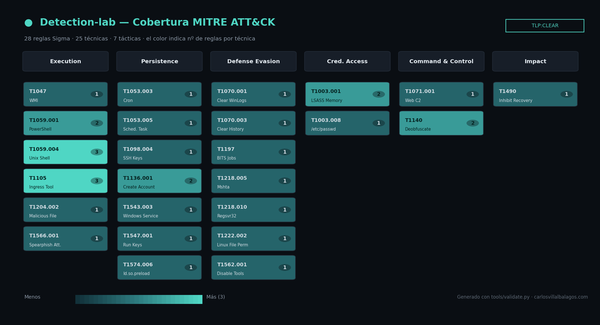
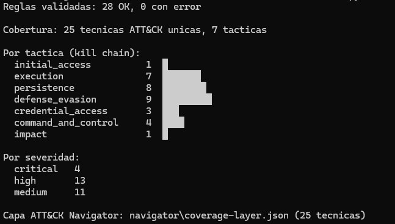

# 🛡️ Detection-lab + Purple Team


Catálogo de detecciones **como código** (Sigma) con validación automática por CI, conversión multi-SIEM y un bucle **purple team** (Atomic Red Team) que mide la cobertura **MITRE ATT&CK**.

Complementa a **[Infra-SocAnalyst](https://github.com/BlueShield-Ch4rl13/Infra-SocAnalyst)**: aquel es la *plataforma* SOC (Wazuh, sensores, SOAR); este es el **contenido de detección y su validación**.

<!-- CAPTURA 1: el heatmap de ATT&CK Navigator con coverage-layer.json cargado -->


> **28 reglas → 25 técnicas ATT&CK en 7 tácticas**, validadas en cada commit y convertidas a Wazuh / Splunk / Elastic.

---

## 🎯 Decisiones técnicas (el porqué)

- **Sigma en vez de reglas nativas de Wazuh.** Las reglas se escriben una vez en formato portable y se convierten a cualquier SIEM (Wazuh, Splunk, Elastic). No quedan atadas a un despliegue, que es justo lo que se espera de un catálogo de detección reutilizable.
- **Detection-as-code con CI.** Un GitHub Action valida las 28 reglas con pySigma en cada push y publica la capa de cobertura como artefacto. Una regla rota no llega a `main`.
- **Purple team medible, no anecdótico.** Cada técnica se enlaza con su prueba de Atomic Red Team y con la regla que debe detectarla, y la cobertura se cuantifica en un heatmap — se ve qué se detecta y, más importante, dónde están los huecos.
- **Se apoya en infra existente, no la duplica.** Aporta lo que a Infra-SocAnalyst le faltaba: detección **Windows/Sysmon** (su demo es solo Linux) y la emulación de adversario que su propio "trabajo futuro" pedía.

---

## 📸 En acción

<!-- CAPTURA 2: la salida de validate.py en la terminal (cobertura por táctica) -->


---

## 📂 Qué hay dentro

| Carpeta | Contenido |
|---|---|
| `rules/windows/` | Reglas Sigma para telemetría **Sysmon** (18) |
| `rules/linux/` | Reglas Sigma para **auditd/Falco** (10) |
| `tools/validate.py` | Valida las reglas, mide cobertura y genera la capa Navigator |
| `navigator/` | Capa JSON de cobertura para **ATT&CK Navigator** |
| `deploy/` | Reglas ya convertidas a **Wazuh (Lucene) / Splunk / ES\|QL** |
| `purple/atomic-map.md` | Mapeo técnica ↔ **Atomic Red Team** ↔ regla ↔ telemetría |
| `LAB.md` | Cómo montar el bucle purple team sobre tu Wazuh |
| `.github/workflows/` | CI que valida las reglas en cada commit |

---

## 🚀 Uso

```bash
pip install -r requirements.txt          # sigma-cli + pySigma + backends

# 1) Validar reglas y medir cobertura (genera la capa Navigator)
python tools/validate.py

# 2) Convertir a tu SIEM
sigma convert -t lucene -p sysmon rules/windows/    # Wazuh / OpenSearch
sigma convert -t splunk -p sysmon rules/windows/    # Splunk
sigma convert -t esql   -p sysmon rules/windows/    # Elastic ES|QL

# 3) Emular y validar (en el lab): ver purple/atomic-map.md y LAB.md
Invoke-AtomicTest T1059.001
```

Sube `navigator/coverage-layer.json` a [ATT&CK Navigator](https://mitre-attack.github.io/attack-navigator/) (Open Existing Layer) para ver el heatmap.

---

## 🧩 Formato de una regla

```yaml
title: PowerShell con comando codificado
tags: [attack.execution, attack.t1059.001]
logsource: {category: process_creation, product: windows}
detection:
  selection:
    Image|endswith: '\powershell.exe'
    CommandLine|contains: ['-enc', '-EncodedCommand']
  condition: selection
level: high
```

---

## 🔗 El ecosistema

```
News CTI (IOCs) → Detection-lab (detecciones) → Infra-SocAnalyst (Wazuh + SOAR) → ftriage (DFIR)
```

- **[News CTI](https://github.com/BlueShield-Ch4rl13/ScriptNewsCTI)** — inteligencia de amenazas (IOCs).
- **[Infra-SocAnalyst](https://github.com/BlueShield-Ch4rl13/Infra-SocAnalyst)** — la plataforma SOC donde corren las detecciones.

---

## 🔒 Seguridad

Las pruebas de Atomic Red Team se ejecutan **solo en el laboratorio aislado** y se revierten con `-Cleanup`. Las reglas son de detección (defensivas). Uso académico y de respuesta a incidentes.

## 📄 Licencia

MIT.
