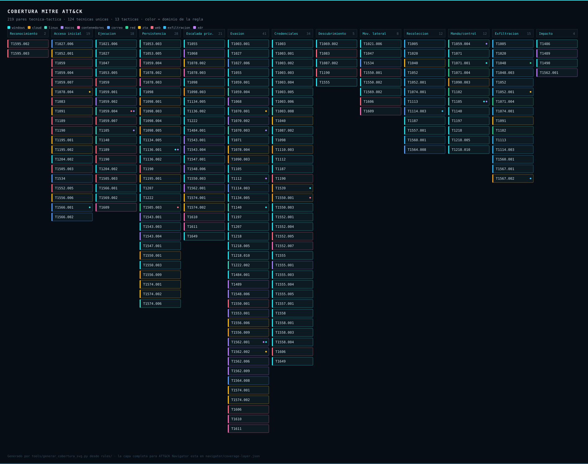

# 🛡️ DetectionLab — detección como código, multi-SIEM


**Una regla se escribe una vez y se despliega en cuatro SIEM.** 87 reglas Sigma
que el CI valida y convierte a Splunk, Microsoft Sentinel, Wazuh y Elastic en
cada commit, más el catálogo Zero Trust y de cumplimiento que las cruza con
NIST SP 800-207, CISA ZTMM 2.0, ENS, NIS2, DORA, ISO 27001/22301 y RGPD.

Complementa a **[Infra-SocAnalyst](https://github.com/BlueShield-Ch4rl13/Infra-SocAnalyst)**:
aquel es la *plataforma* SOC (Wazuh, sensores, SOAR); éste es el **contenido de
detección, su conversión y su validación**.



<sub>Este mapa **se regenera** con `python tools/generar_cobertura_svg.py`. Una
captura de ATT&CK Navigator envejece en cuanto se añade una regla y nadie se
acuerda de rehacerla; ésta siempre dice la verdad. La capa completa para
Navigator sigue en `navigator/coverage-layer.json`.</sub>

---

## 🎯 Las decisiones, y el porqué

**Una fuente, cuatro destinos.** La regla vive en Sigma y `tools/build.py` la
convierte. Los índices, sourcetypes y tablas no están escritos en las reglas:
están en `tools/pipelines/`. Cambiar de entorno es editar un fichero y
regenerar, no reescribir 87 reglas.

**Lo que un backend no soporta se dice, no se disimula.** Tres reglas son
correlaciones Sigma que cuentan cardinalidad en una ventana. El backend de Kusto
no las convierte y Wazuh no puede expresarlas. En vez de convertir sólo la regla
base y llamarlo cobertura —esa regla base tiene nivel `informational` a
propósito, por sí sola no es una señal— hay KQL escrito a mano en
`deploy/sentinel/correlaciones.kql`, y el validador comprueba que sus umbrales
sigan cuadrando con los de Sigma. Los cinco casos que Wazuh no puede expresar
salen como avisos con su motivo.

**Reglas nativas de Wazuh, no consultas Lucene.** Una consulta Lucene sirve para
buscar en el indexador *después*; no alerta. `tools/sigma_to_wazuh.py` genera
reglas XML reales: como Wazuh combina con AND todas las condiciones de una
regla, el conversor pasa la condición Sigma a forma normal disyuntiva aplicando
De Morgan y emite una regla por cada término. 87 reglas Sigma → **139 reglas de
Wazuh**.

**El CI comprueba que `deploy/` está al día.** Regenera todo y falla si el
resultado no coincide con lo commiteado. Sin eso, una regla se modifica, sus
consultas se quedan viejas, y lo que está desplegado deja de ser lo que dice el
repositorio.

**Purple team medible.** Cada técnica se enlaza con su prueba de Atomic Red Team
y con la regla que debe detectarla. La cobertura se cuantifica en un heatmap: se
ve qué se detecta y, más importante, dónde están los huecos.

---

## 📊 Qué cubre

| Dominio | Reglas | Telemetría |
|---|---:|---|
| `rules/windows/` | 29 | Sysmon, canal Security, Defender XDR |
| `rules/cloud/` | 10 | Entra ID (SigninLogs, AuditLogs), M365, Netskope |
| `rules/linux/` | 10 | auditd, Falco |
| `rules/macos/` | 8 | Endpoint Security Framework |
| `rules/contenedores/` | 8 | Auditoría de Kubernetes, runtime de contenedores |
| `rules/correo/` | 8 | Proofpoint TAP, Exchange Online |
| `rules/zta/` | 8 | Detecciones de arquitectura Zero Trust |
| `rules/red/` | 6 | Proxy, DNS, servidor web, NetFlow |

**55 técnicas ATT&CK base** (86 contando subtécnicas) en **12 tácticas**.
15 críticas · 45 altas · 24 medias · 3 informativas (bases de correlación).

---

## 🚀 Uso

```bash
pip install -r requirements.txt

# 1) Validar la biblioteca y medir la cobertura ATT&CK
python tools/validate.py

# 2) Generar el contenido de los cuatro SIEM (unos 6 segundos)
python tools/build.py

# 3) Convertir una regla suelta, para ver la salida
sigma convert -t splunk -p sysmon -p splunk_windows -p tools/pipelines/splunk.yml \
              rules/windows/soc_edr_001_volcado_lsass.yml

sigma convert -t kusto  -p tools/pipelines/sentinel.yml -p sentinel_asim \
              -p tools/pipelines/sentinel-post.yml \
              rules/windows/soc_edr_001_volcado_lsass.yml

# 4) Emular y validar en el lab: ver purple/atomic-map.md y LAB.md
Invoke-AtomicTest T1003.001
```

Sube `navigator/coverage-layer.json` a
[ATT&CK Navigator](https://mitre-attack.github.io/attack-navigator/)
(*Open Existing Layer*) para ver el heatmap.

---

## 📂 Qué hay dentro

| Ruta | Contenido |
|---|---|
| `rules/` | Las 87 reglas Sigma, por dominio |
| `deploy/splunk/` | `savedsearches.conf` con cadencia, severidad y notables |
| `deploy/sentinel/` | Consultas KQL por dominio + las tres correlaciones a mano |
| `deploy/wazuh/` | Reglas XML nativas: 139 generadas + 73 de marco escritas a mano |
| `deploy/elastic/` | Lucene (indexador Wazuh / OpenSearch) y ES\|QL |
| `marcos/` | Catálogos Zero Trust y de cumplimiento, y la matriz control ↔ marco |
| `tools/build.py` | El generador multi-SIEM |
| `tools/validate.py` | Validación, cobertura ATT&CK y coherencia de `deploy/` |
| `tools/sigma_to_wazuh.py` | Backend propio Sigma → XML de Wazuh (DNF + De Morgan) |
| `tools/pipelines/` | Índices, sourcetypes y tablas. **El único sitio donde tocar el entorno** |
| `navigator/` | Capa de cobertura para ATT&CK Navigator |
| `purple/atomic-map.md` | Técnica ↔ Atomic Red Team ↔ regla ↔ telemetría |
| `docs/` | Fusión de bibliotecas, marcos y cumplimiento |
| `LAB.md` | Cómo montar el bucle purple team sobre tu Wazuh |

---

## 🧩 Cómo se ve una regla en los cuatro SIEM

Origen — `rules/windows/soc_edr_003_borrado_copias_sombra.yml`:

```yaml
title: Destruccion de copias de seguridad y puntos de restauracion
tags: [attack.impact, attack.t1490]
logsource: {category: process_creation, product: windows}
detection:
  selection_vssadmin:
    Image|endswith: '\vssadmin.exe'
    CommandLine|contains|all: ['delete', 'shadows']
  # ... wmic, wbadmin, bcdedit, powershell
  condition: 1 of selection_*
level: critical
```

Salidas generadas:

```spl
# Splunk
source="WinEventLog:Microsoft-Windows-Sysmon/Operational" EventCode=1
  (Image="*\\vssadmin.exe" CommandLine="*delete*" CommandLine="*shadows*") OR ...
```

```kusto
// Microsoft Sentinel
imProcessCreate
| where (TargetProcessName endswith "\\vssadmin.exe" and ...) or ...
```

```xml
<!-- Wazuh: una regla por termino de la forma normal disyuntiva, 5 en total -->
<rule id="101104" level="14">
  <if_group>windows</if_group>
  <field name="win.system.eventID" type="pcre2">^(1)$</field>
  <field name="win.eventdata.image" type="pcre2">(?i)\\vssadmin\.exe$</field>
  <field name="win.eventdata.commandLine" type="pcre2">(?i)(?=.*delete)(?=.*shadows)</field>
  <description>SOC-EDR-003: Destruccion de copias de seguridad [1/5]</description>
  <mitre><id>T1490</id></mitre>
</rule>
```

---

## 🔗 El ecosistema

```
News CTI (IOCs) → Detection-lab (detecciones) → Infra-SocAnalyst (Wazuh + SOAR) → ftriage (DFIR)
```

- **[News CTI](https://github.com/BlueShield-Ch4rl13/ScriptNewsCTI)** — inteligencia de amenazas (IOCs).
- **[Infra-SocAnalyst](https://github.com/BlueShield-Ch4rl13/Infra-SocAnalyst)** — la plataforma SOC donde corren las detecciones.

---

## 📖 Documentación

- **[Fusión de bibliotecas](docs/fusion-de-bibliotecas.md)** — qué reglas se
  retiraron al unir dos catálogos, cuáles sobrevivieron y por qué, incluidas las
  dos pérdidas de cobertura asumidas a propósito.
- **[Marcos y cumplimiento](docs/marcos-y-cumplimiento.md)** — las dos vías de
  detección, qué no cabe en Sigma y por qué, y la matriz control ↔ marco.
- **[LAB.md](LAB.md)** — montar el bucle purple team sobre Wazuh.

---

## 🔒 Seguridad

Las pruebas de Atomic Red Team se ejecutan **sólo en el laboratorio aislado** y
se revierten con `-Cleanup`. Las reglas son de detección (defensivas). Uso
académico y de respuesta a incidentes.

## 📄 Licencia

MIT.
